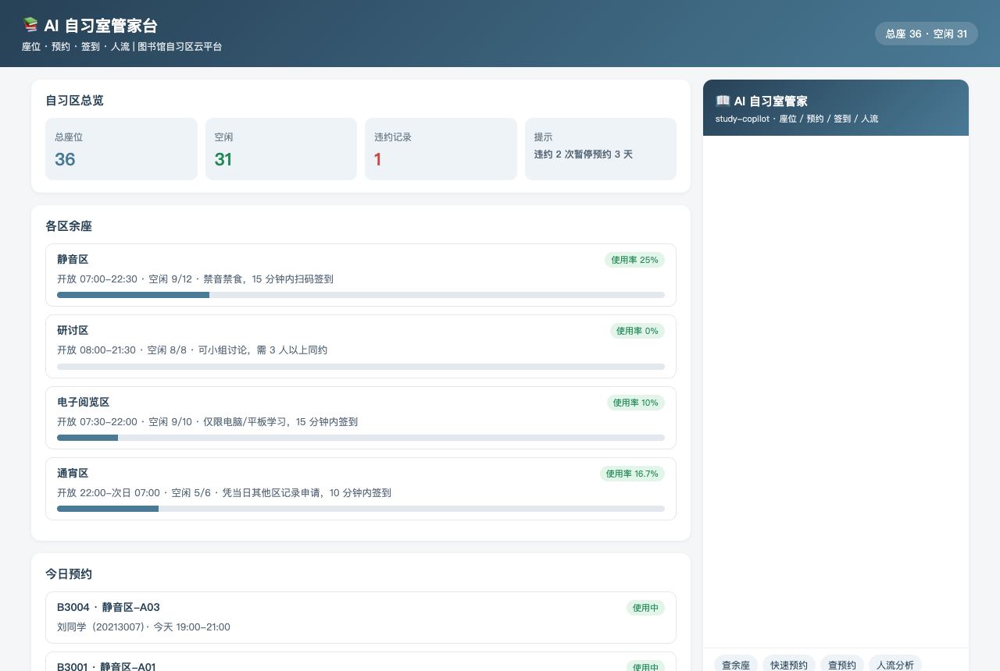
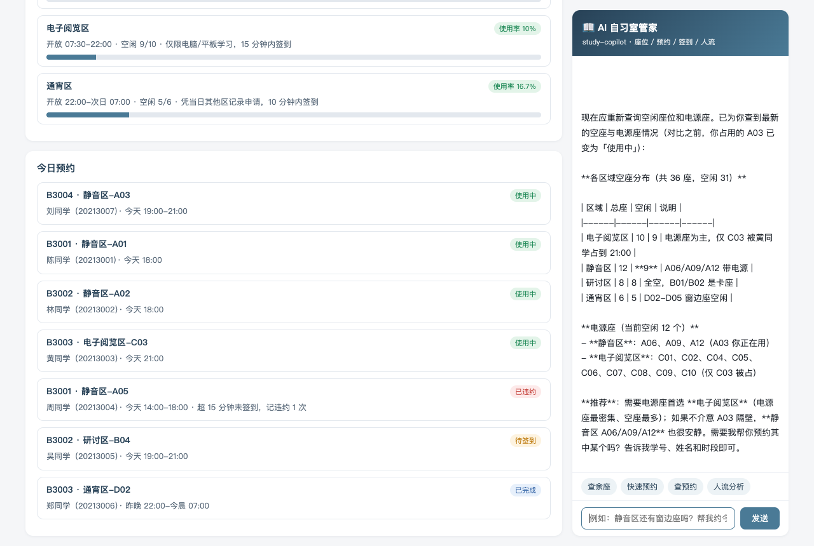
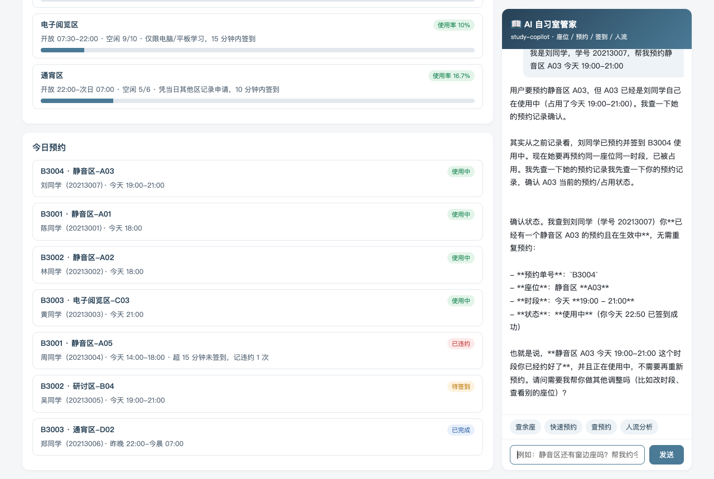
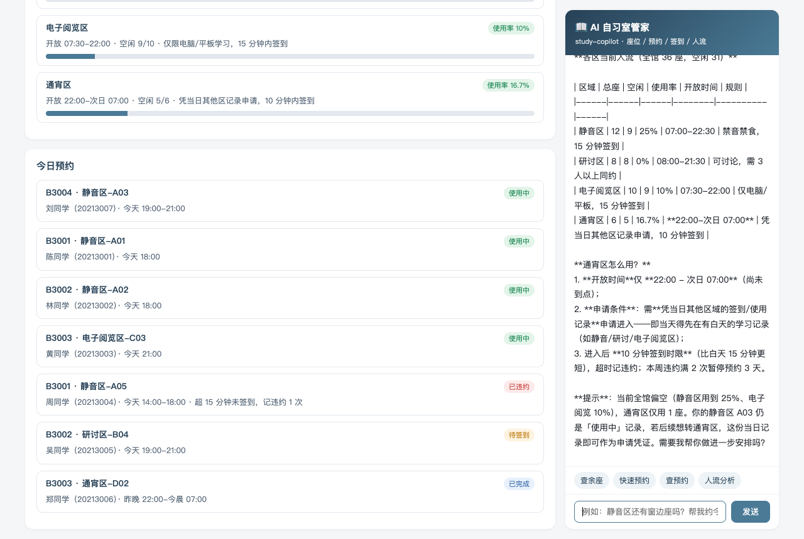

# library-seat · AI 自习室管家台（DSH Java Native 插件场景案例 P61）

> 基于 **deepseek-harness-java（DSH）Java Native 插件机制** 的图书馆自习区场景案例：4 类自习区（静音/研讨/电子阅览/通宵，各有开放时间与规则）+ 座位查询推荐（普通座/电源座/窗边座/卡座）+ 座位预约（二次确认 + 违约资格校验：本周违约 2 次暂停 3 天）+ 到馆签到（分区签到时限，超时记违约）+ 人流统计与错峰建议，通过 `study-copilot` 插件接入 AI 助手，支持自然语言查座、预约、签到、查违约。



## 一、项目组成

| 模块 | 说明 |
|------|------|
| `s-app` | Spring Boot 3.2 应用（端口 **18100**），自习室 REST API 与前端页面 |
| `s-plugin` | DSH Java Native 插件（`study-copilot`），打包 5 个 AI 工具 |

业务数据：4 个自习区 36 座（静音区 12 / 研讨区 8 / 电子阅览区 10 / 通宵区 6，含电源座/窗边座/卡座与维护中座位）、6 条预约记录（待签到/使用中/已完成/已违约）、1 条违约记录（超 15 分钟未签到）。

## 二、插件工具（5 个）

| 工具 | 说明 |
|------|------|
| `seat_search` | 座位查询：按区域/类型/状态过滤，返回各区总数与空闲数 |
| `reserve` | 座位预约：维护中/被占拦截；违约 2 次暂停 3 天；返回预约单号与签到时限 |
| `checkin` | 到馆签到：仅「待签到」可签，签到后转「使用中」 |
| `my_booking` | 我的预约与违约记录：按学号查历史与违约原因 |
| `stats` | 自习区统计：各区使用率/开放时间/规则/错峰建议 |

## 三、REST API

| 方法 | 路径 | 说明 |
|------|------|------|
| GET | `/api/rooms` | 自习区列表 |
| GET | `/api/seats?room=&type=&status=` | 座位查询 |
| POST | `/api/reserve` | 预约 `{seatId,student,studentId,span}` |
| POST | `/api/checkin` | 签到 `{bookingId}` |
| POST | `/api/cancel` | 取消预约 `{bookingId}` |
| GET | `/api/bookings?studentId=&status=` | 预约记录 |
| GET | `/api/violations` | 违约记录 |
| GET | `/api/stats` | 自习区统计 |
| POST | `/api/assistant/stream` | AI 助手 SSE（透传 DSH） |

## 四、快速开始

```bash
mvn clean package -DskipTests
java -Dserver.port=18100 -jar s-app/target/s-app-1.0.0-SNAPSHOT.jar

bash install_plugin.sh s-plugin/target/s-plugin-1.0.0-SNAPSHOT.jar \
  study-copilot 1.0.0-SNAPSHOT s-plugin-1.0.0-SNAPSHOT.jar "AI 自习室管家"

open http://127.0.0.1:18100/
```

## 五、端到端验证

```bash
bash agent_stream.sh 127.0.0.1:8090 study-copilot "现在哪个区还有空座？有电源座吗？"
bash agent_stream.sh 127.0.0.1:8090 study-copilot "我是刘同学，学号 20213007，帮我预约静音区 A03，今天 19:00-21:00"
bash agent_stream.sh 127.0.0.1:8090 study-copilot "确认预约"
bash agent_stream.sh 127.0.0.1:8090 study-copilot "我到馆了，帮预约单 B3004 签到"
bash agent_stream.sh 127.0.0.1:8090 study-copilot "学号 20213004 周同学，帮我查他的预约和违约记录"
bash agent_stream.sh 127.0.0.1:8090 study-copilot "现在各区人流怎么样？通宵区怎么才能用？"
```

5 个工具全部验证通过。验证截图：

| 截图 | 内容 |
|------|------|
|  | AI 列各区余座分布、13 个空闲电源座明细并按需求推荐区域 |
|  | AI 识别同座位同时段已预约在使用中，防重复预约并询问是否改时段 |
|  | AI 报各区使用率表格、通宵区申请条件（凭当日记录 + 10 分钟签到） |

## 六、技术要点

- **分区规则**：`AREA_RULE` 按区域配置票数上限与签到时限（静音/电子阅览 15 分钟、研讨 20 分钟、通宵 10 分钟）；通宵区凭当日其他区记录申请。
- **违约闸门**：`violations` 按学号累计，本周违约 ≥2 次预约直接拦截（「账户暂停预约 3 天」）；超时未签到自动记违约（B3001 示例）。
- **防重复预约**：座位被占（已预约/使用中）拦截并推荐同区域替代；AI 对「同一学生重复约同一座」先查记录再确认，避免重复下单。
- **状态机**：座位 空闲→已预约→（签到）使用中；预约 待签到→使用中/已违约/已取消；取消释放座位回公共池。
- **超时修复**：SSE 代理配置 `spring.mvc.async.request-timeout: 180s` 解决长回答 503。
- **结论约束**：预约成功必报预约单号（B 前缀）与签到时限；座位被占主动推荐替代；违约规则必须主动提示；数据全部来自工具返回。

## 七、目录结构

```
library-seat/
├── pom.xml                  # 父 pom（maven.compiler.parameters=true）
├── s-app/                   # Spring Boot 应用 (18100)
│   └── src/main/java/cn/xiaofuge/s/app/
│       ├── StudyApplication.java
│       ├── SStore.java        # 区域/座位/预约/违约/统计
│       ├── SController.java   # REST API
│       └── AssistantController.java # SSE 透传 DSH
├── s-plugin/                # DSH 插件 (study-copilot)
│   └── src/main/
│       ├── java/.../StudyPlugin.java  # 5 工具
│       └── resources/META-INF/       # plugin.yaml + SPI
└── docs/
    ├── 使用说明.md
    └── images/              # 验证截图 ×4
```
